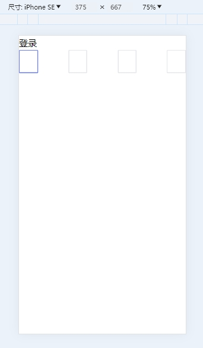
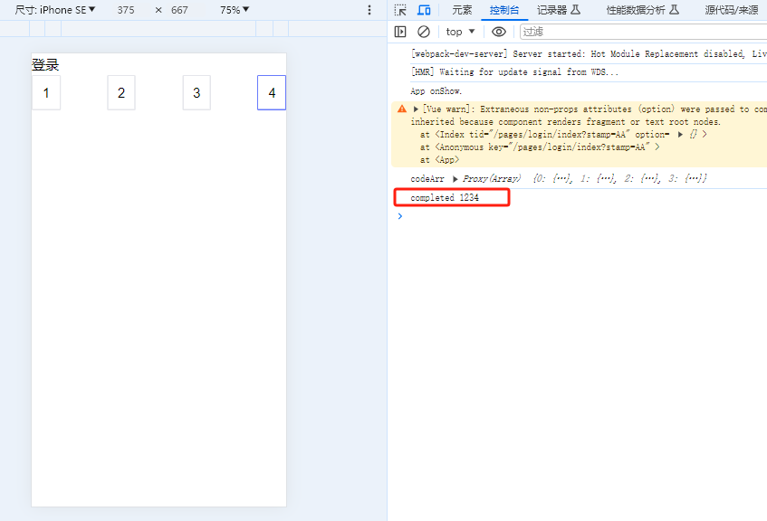

# vue-word
vue template


###### 1、phone-code-verify 短信验证码SMS verification code #######
```
<template>
    <PhoneCodeVerify @completed="completed"/>
</template>

<script setup>
import PhoneCodeVerify from "@components/phone-code-verify/index";
function completed(value) {
    console.log("completed",value);
}
</script>
```
效果图
---


